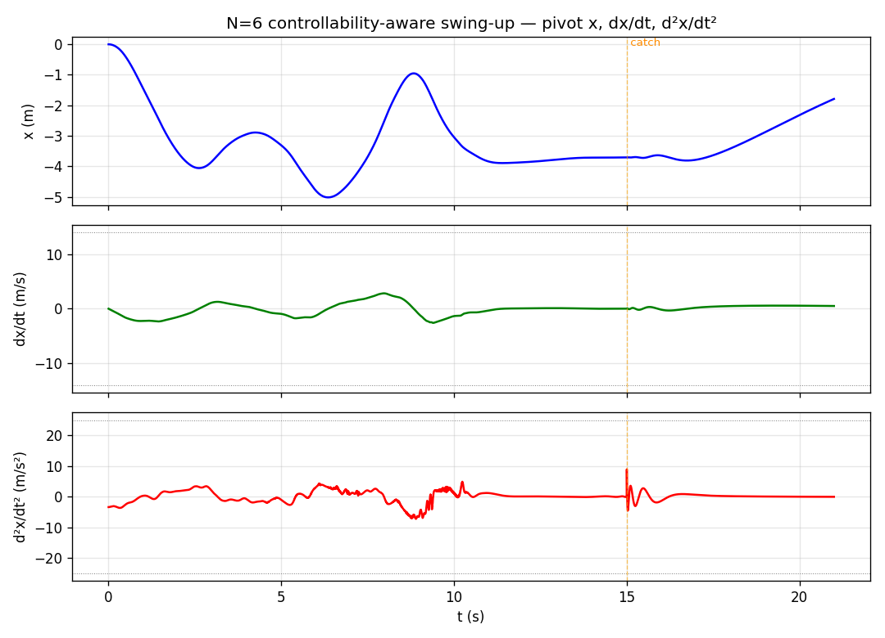
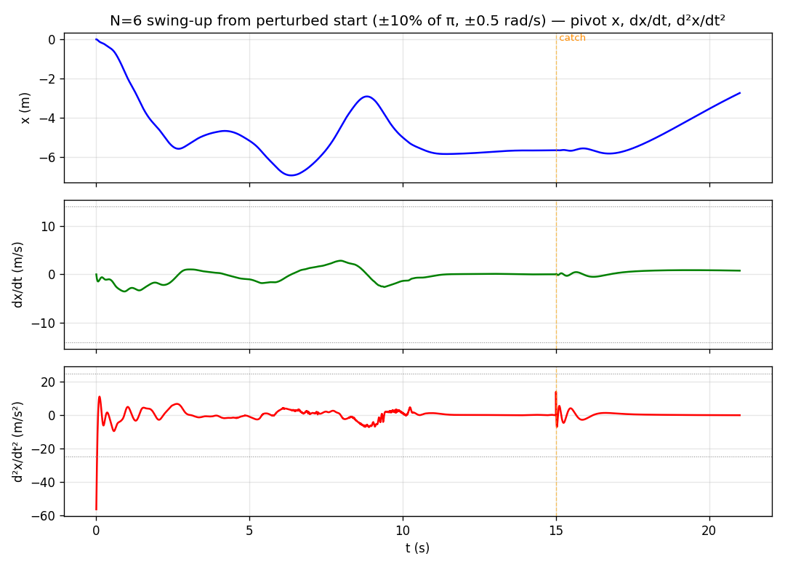

# Inverted N-link pendulum: control & precision limits

An inverted **N-link pendulum** actuated by **one input only** — the horizontal
velocity of its base pivot. Uniform rods (mass 1, length 1); angles measured from
upright. We ask two questions and push them to their limits:

1. **Balance** — hold the chain upright.
2. **Swing-up** — bring it from hanging to upright and balance.

…and, given the simulation parameters (gravity *g*, timestep *dt*), **what
precision** on the angle measurement (δθ) and velocity command (δv) does each task
require? The dynamics are hand-derived and verified (SymPy + energy
conservation); controllers are LQR (balance) and direct-collocation + TVLQR
(swing-up).

**Headline findings**

- Required **angle** precision tightens ≈ 6–20× per added link; **velocity**
  precision is nearly flat — so **sensing, not actuation, is the binding
  constraint** (basin shrinks ~4×/link × noise-amplification grows ~5×/link).
- Everything scales through one dimensionless group **u = dt·√(g/L)** (an exact
  time-rescaling symmetry: lower gravity ≡ smaller timestep).
- **Swing-up reaches N = 5** with realistic angle-only sensing. **N = 6** works
  under full-state feedback; its mid-swing near-*straight* configuration is
  near-uncontrollable from one pivot, so trackability depends on the trajectory's
  "bend order". We remove the reliance on a hand-curated seed with a
  **controllability-aware trajectory optimization** (and cut peak pivot
  acceleration ~7×). **N = 7** is a characterized frontier wall.

Full write-up: **[PAPER.md](PAPER.md)**. Reproduction: **[repro/](repro/README.md)**.

## Results — N = 6 swing-up (full-state)

### Controllability-aware (seed-free)

Hanging → balanced upright, generated with **no curated seed** (a controllability
objective produces a trackable trajectory by construction); settles to 0.018°,
peak pivot acceleration ≈ 7 m/s².

<video src="https://github.com/m1el/inverted-pendulum/raw/main/media/swingup_N6_ctrbaware.mp4" controls width="420"></video>

*(if the video doesn't play inline: [media/swingup_N6_ctrbaware.mp4](media/swingup_N6_ctrbaware.mp4))*

Pivot trajectory — position, velocity, acceleration (orange line = swing-up →
catch handoff):



### From a perturbed start (robustness)

The same controls from a **perturbed** initial state (links ±10% of π off
hanging, ±0.5 rad/s) — the TVLQR feedback rejects the deviation and still swings
up. 16/16 seeds pass at ±10%; robust to ±0.8 rad (25% of π).

<video src="https://github.com/m1el/inverted-pendulum/raw/main/media/swingup_N6_perturbed.mp4" controls width="420"></video>

*(fallback: [media/swingup_N6_perturbed.mp4](media/swingup_N6_perturbed.mp4))*

Pivot x, v, a — note the larger initial acceleration spike correcting the
perturbed start, then the same swing:



## Repository

| Path | What |
|---|---|
| `pendulum/` | verified dynamics, RK4 sim, LQR balancers, collocation, swing-up controllers |
| `repro/` | reproduction: seed-free N=6 generator, fast-from-seed, general-N, verify+animate, perturbed-start challenge ([README](repro/README.md)) |
| `results/` | precision-sweep data + notes (balance, swing-up) |
| `media/` | animations and plots |
| `PAPER.md` | research-paper write-up (methods, results, dead ends, paths forward) |
| `PROGRESS.md` | chronological research log |
| `sessions/` | redacted transcripts of the agent sessions that produced this |

## Quick start

```bash
uv run python tests/test_dynamics.py                 # verify dynamics
uv run python repro/generate_n6.py                   # seed-free N=6 swing-up -> repro/n6_controls.npz
uv run python repro/simulate_n6.py out.mp4           # verify (PASS) + render
uv run python repro/perturbed_n6.py --render p.mp4   # perturbed-start challenge
```
